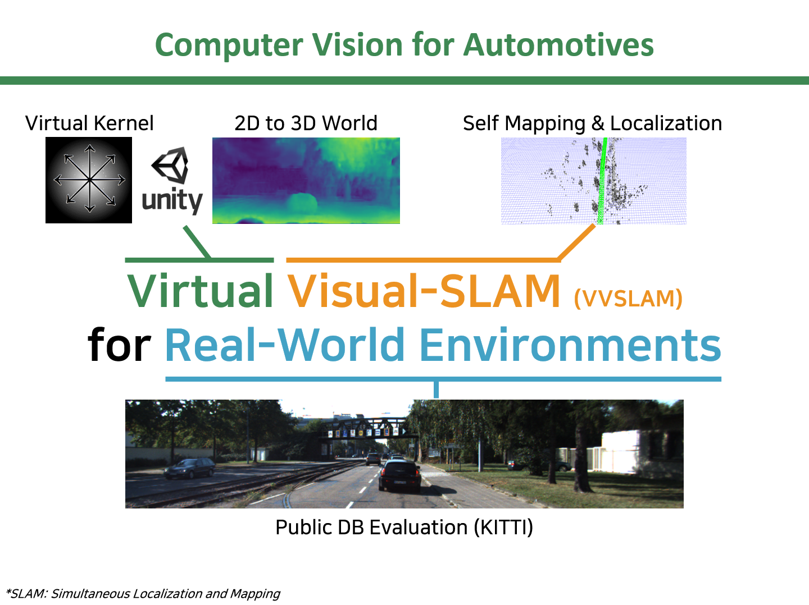
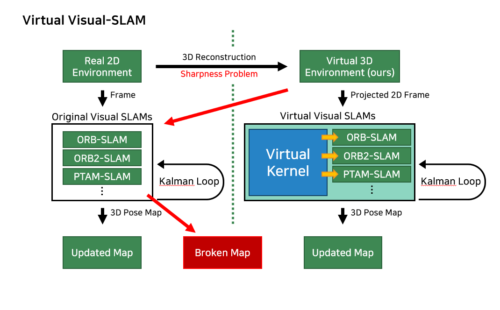
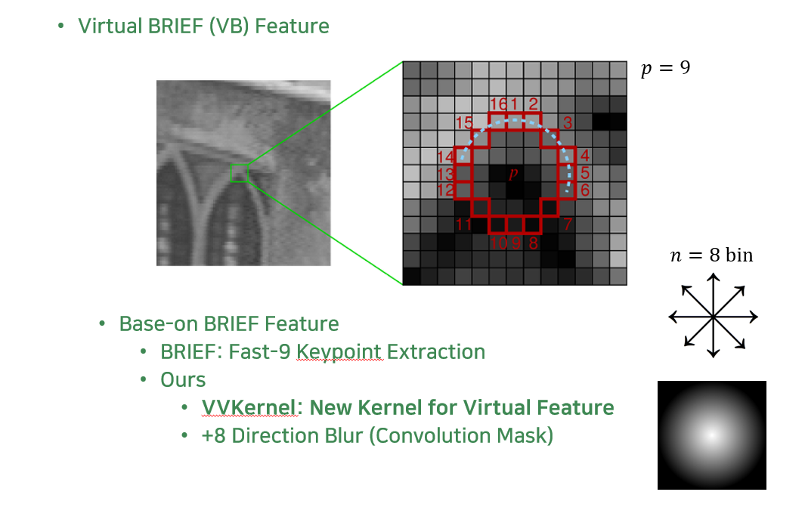

# Jea-Young Jeon
* Computer Vision for ADAS / C# & Python / WPF & UI

# Latest works

* [[VVSLAM] Virtual Visual SLAM for Real-World Environment](https://github.com/jyjeon-dev/VVSLAM), 2020
* [[CSSLAM] C# Visual-SLAM](https://github.com/jyjeon-dev/CsharpSlam), 2020
* [AirSim Monitor Setup for C#/WPF](https://github.com/jyjeon-dev/airsimMonitor), 2019
* [C#/WPF Mahapps.Metro High Performance](https://github.com/jyjeon-dev/flasharpMetro), 2019

# VVSLAM Demo

VVSLAM Demo Youtube https://youtu.be/EAyqxnwDfD4

# Contect
* jyjeon @no_spam@ outlook.com
* jyjeon @no_spam@ postech.ac.kr
