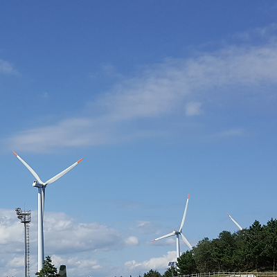

# Jea-Young Jeon
* Computer Vision for ADAS / C# & Python / WPF & UI

# Latest works

* [[VVSLAM] Virtual Visual SLAM for Real-World Environment](https://github.com/jyjeon-dev/VVSLAM), 2020
* [[CSSLAM] C# Visual-SLAM](https://github.com/jyjeon-dev/CsharpSlam), 2020
* [AirSim Monitor Setup for C#/WPF](https://github.com/jyjeon-dev/airsimMonitor), 2019
* [C#/WPF Mahapps.Metro High Performance](https://github.com/jyjeon-dev/flasharpMetro), 2019

# VVSLAM

## Abstract

Visual Simultaneous Localization and Mapping (VSLAM) researchers use or produce public databases to secure enough data. Public databases may not be in the environment that researchers want, so there are many difficult situations. But it takes a lot of time and cost to make a database themselves. If the lane direction of a public database is the opposite direction against the developer’s country, then the use of that database has to be abandoned. And the engineer may want to make every scene in the public database rainy or snowy for extreme VSLAM evaluation. If there is a virtual database that can be manipulated to fit the environment on demand (e.g. Lane andWeather Conditions), it will be a great help to research and development.

In this research, we studied a new Virtual VSLAM for virtual environments and evaluate it for real- and virtual-environments so that our method can show similar results for both environments. Then we developed an additional system which can provide database transform that is hard to achieve in reality. We first simulate several VSLAMs in the well-known game engine for virtual environment. We show several VSLAMs such as ORB, ORB2 to be compared. Then, we reconstruct the public database into 3D map or texture to be able to modify the map in virtual environment. As a result, The researchers will be able to both process the existing database in a more suitable form for test and analyze the performance of various VSLAMs. We used AirSim simulator under the Unity game engine.

VVSLAM Demo Youtube: [https://youtu.be/EAyqxnwDfD4](https://youtu.be/EAyqxnwDfD4)

VVSLAM Article: [POSTECH Library](https://postech-primo.hosted.exlibrisgroup.com/primo-explore/fulldisplay?docid=82POSTECH_INST21232402040003286&vid=82POSTECH&search_scope=alma_scope&tab=alma_tab&lang=ko_KR&context=L)

# Publications
- J.Young Jeon, et al. "Polygonal symmetry transform for detecting rectangular traffic signs." 2014 14th International Conference on Control, Automation and Systems (ICCAS 2014). IEEE, 2014.
- J.Young Jeon and Soohee Han. "Virtual Visual SLAM for Real-World Environment." [2020 POSTECH Thesis](https://postech-primo.hosted.exlibrisgroup.com/primo-explore/fulldisplay?docid=82POSTECH_INST21232402040003286&vid=82POSTECH&search_scope=alma_scope&tab=alma_tab&lang=ko_KR&context=L). POSTECH, 2020.

# Contact
* jyjeon @no_spam@ outlook.com
* jyjeon @no_spam@ postech.ac.kr

